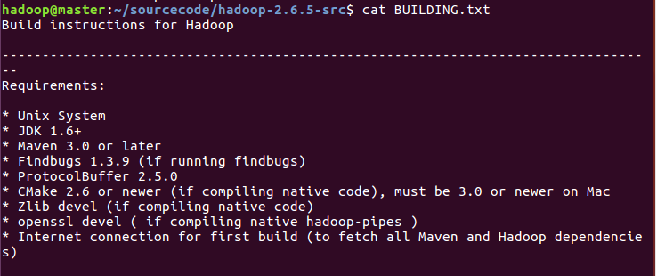
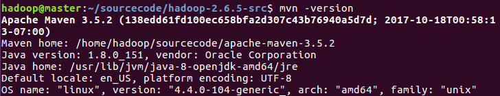
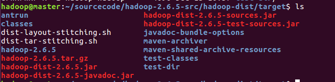
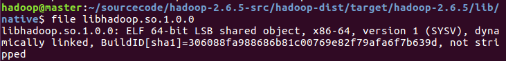

### Hadoop源码编译

##### Hadoop源代码准备

```Linux
mkdir sourcecode
tar -xzvf ~/Downloads/hadoop-2.6.5-src.tar.gz
cd hadoop-2.6.5-src
cat BUILDING.txt
```



#####Maven安装

```Linux
unzip ~/Downloads/apache-maven-3.5.2-bin.zip
sudo gedit /etc/profile

export MAVEN_HOME=~/sourcecode/apache-maven-3.5.2
export MAVEN_OPTS="-Xms256m -Xmx512m"
export PATH=$MAVEN_HOME/bin:$JAVA_HOME/bin:$PATH

mvn -version
```



##### protobuf安装

tar -zxvf ~/Downloads/protobuf-2.5.0.tar.gz

cd protobuf-2.5.0

sudo apt-get install gcc gcc-c++ make cmake

./config --prefix=/usr/local/protobuf

sudo make

sudo make install

sudo gedit /etc/profile


export PROTOC_HOME=/usr/local/protobuf
export PATH=\$PROTOC_HOME/bin:\$MAVEN_HOME/bin:\$JAVA_HOME/bin:\$PATH

source /etc/profile

protoc --version

libprotoc 2.5.0

##### Findbugs安装

unzip ~/Downloads/findbugs-1.3.9.zip

sudo gedit /etc/profile


export FINDBUGS_HOME=/opt/software/findbugs-1.3.9
export PATH=\$FINDBUGS_HOME/bin:\$PROTOC_HOME/bin:\$MAVEN_HOME/bin:\$JAVA_HOME/bin:$PATH

source /etc/profile

findbugs -version

##### 其他依赖

sudo apt-get install -y openssl openssl-devel svn ncurses-devel zlib-devel libtool

##### 开始编译

- 加快编译速度的小技巧：在maven的config文件夹下的setting.xml中加入阿里云的mirro

  ```Linux
  <mirror>
      <id>nexus-aliyun</id>
      <mirrorOf>*</mirrorOf>
      <name>Nexus aliyun</name>
      <url>http://maven.aliyun.com/nexus/content/groups/public</url >
  </mirror>
  ```

- hadoop的一个bug，在pom.xml中添加下面patch即可，详见https://issues.apache.org/jira/browse/HADOOP-10110 。

  编辑`hadoop-common-project/hadoop-auth/pom.xml`文件：

  在`<dependencys></dependencys>`节点中插入：

  ```
  <dependency>
    <groupId>org.mortbay.jetty</groupId>
    <artifactId>jetty-util</artifactId>
    <scope>test</scope>
  </dependency> 
  ```

```Linux

cd hadoop-2.6.5-src
mvn clean package -Pdist,native -DskipTests -Dtar
```


##### 编译成果

~/sourcecode/hadoop-2.6.5-src/hadoop-dist/target/hadoop-2.6.5.tar.gz



 hadoop-2.6.5是编译后的文件夹，hadoop-2.6.5.tar.gz是编译后的打包文件

##### 验证

```Linux
cd ~/sourcecode/hadoop-2.6.5-src/hadoop-dist/target/hadoop-2.2.0/lib/native/

file libhadoop.so.1.0.0

```



可以看到，libhadoop.so.1.0.0已经是64位的了

##### 拷贝

将编译好的64位hadoop-2.6.5.tar.gz部署包，拷贝到当前用户目录。

```Linux
cp ~/sourcecode/hadoop-2.6.5-src/hadoop-dist/target/hadoop-2.6.5.tar.gz ~
```

##### 问题

Hadoop-hdfs kill：可能是因为内存不足，所以不得不杀掉进程

free -m显示当前内存

dmesg：

[21488]   505 21488    41501      136   0       0             0 su
[21489]     0 21489    27118      118   0       0             0 bash
[ 4281]     0  4281     4230       51   0       0             0 anacron
[ 6720]     0  6720    25102      268   0       0             0 sshd
[ 6723]     0  6723    27138      115   0       0             0 bash
[ 8120]     0  8120   328708   143044   0       0             0 java
[10508]     0 10508   334272   126747   0       0             0 javadoc
Out of memory: Kill process 8120 (java) score 268 or sacrifice child
Killed process 8120, UID 0, (java) total-vm:1314832kB, anon-rss:572096kB, file-rss:80kB


